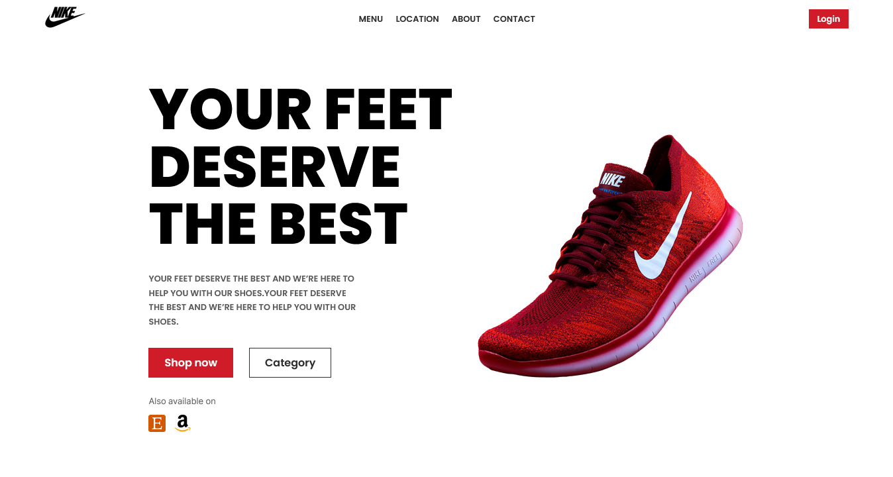

# Nike - brand page

This is the front-end code of the [Nike brand page](https://www.figma.com/file/rephrU2FVgN8MFz6XhnP51/Learn-React-with-10-Projects?type=design&node-id=0-1&t=ExzjQLThD1EGWh8Q-0) design.

## Table of contents

- [Overview](#overview)
  - [The challenge](#the-challenge)
  - [Screenshot](#screenshot)
  - [Links](#links)
  - [Built with](#built-with)
  - [Useful resources](#useful-resources)
- [Author](#author)

## Overview

### The challenge

The challenge is to create the [Nike brand page](https://oumlillahoucine.github.io/nike-brand-page) and make it look as close to this [design](https://www.figma.com/file/rephrU2FVgN8MFz6XhnP51/Learn-React-with-10-Projects?type=design&node-id=0-1&t=ExzjQLThD1EGWh8Q-0).

### Screenshot

The result:\

### Links

- Solution URL: [Nike-brand-design-code](https://github.com/OumlilLahoucine/nike-brand-page)
- Live Site URL: [Nike-brand-design-live](https://oumlillahoucine.github.io/nike-brand-page)

### Built with

- Semantic HTML5 markup
- CSS custom properties
- Flexbox
- Css Grid
- ReactJs
- Desktop-first workflow

### Useful resources

- I personally really like the Udemy courses of 'Jonas Schmedtmann' (specially, [Build Responsive Real-World Websites with HTML and CSS](https://www.udemy.com/course/design-and-develop-a-killer-website-with-html5-and-css3/) & [The Ultimate React Course 2024: React, Redux & More](https://www.udemy.com/course/the-ultimate-react-course/))

## Author

- Github - [Oumlil Lahoucine](https://github.com/oumlillahoucine)
- Frontend Mentor - [@oumlillahoucine](https://www.frontendmentor.io/profile/OumlilLahoucine)
